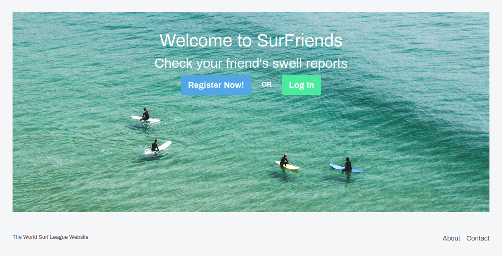

<p align="center">
  <a href="https://github.com/jcy2704/oop-ruby">
    
  </a>
</p>

<h1 align="center">SurFriends</h1>

<p align="center">
  <strong>Project by Thales Neves</strong>
  <br>
  Created with Ruby On Rails.<br>
</p>

<p align="center">
  <a href="https://github.com/thneves/SurFriends/issues">
    
  </a>
   ‎ ‎ ‎ ‎
  <a href="https://github.com/thneves/SurFriends/issues">
    
  </a>
</p>

# SurFriends Social Media

## Table of Contents
- [SurFriends Social Media](#surfriends-social-media)
  - [Table of Contents](#table-of-contents)
  - [Preview](#preview)
  - [About SurFriends](#about-surfriends)
  - [Main Features](#main-features)
    - [Profile](#profile)
    - [Posts and Feed](#posts-and-feed)
    - [Follow and Unfollow](#follow-and-unfollow)
  - [Live Demo](#live-demo)
  - [Video Presentation](#video-presentation)
  - [Technical](#technical)
  - [Built With](#built-with)
  - [💻 Getting Started](#-getting-started)
    - [Prerequisites](#prerequisites)
    - [Setup](#setup)
    - [Usage](#usage)
    - [Run tests](#run-tests)
    - [Deployment](#deployment)
  - [Author](#author)
  - [🤝 Contributing](#-contributing)
  - [Show your support](#show-your-support)
  - [Acknowledgments](#acknowledgments)


## Preview




## About SurFriends
Surfriends is a twitter like social media web app with the porpuse of finding new surf friends and share ideas about surfing.

## Main Features
I created the basic features of a social media app.

### Profile
Each user has a profile with proper authentication with email and password for login and logout, users can also upload his profile picture and also edit all information at any time. The profile also stores and show stats of the user.

The User also can access other users profile to check their stats, posts and follow them.

### Posts and Feed
The main features of the page it's the **Posts and Feed**.

Each user can create **Posts** to share his thoughts to other users, the user can delete his own posts at any time.

The **Feed** shows all other users posts also in order of creation in the Home Page.

### Follow and Unfollow

Like any social media I implemented a way to create a connection with other users by **follow and unfollow** feature. After following another user, his posts will appear now in your feed. The user can also unfollow the user at anytime. 

In each user profile there is also a link to the list of the people he is following and his followers.

A list of users that you're not following yet will appear in your home page as suggestion for you to follow them.

When visiting other user profile, also it shows a list of the users that are following him.

## Live Demo

[SurFriends](https://surfriends.herokuapp.com/)

## Video Presentation

[Video Presentation](https://www.loom.com/share/2c048c9b88af40cea50c1e96ab4823c5?sharedAppSource=personal_library)

## Technical

- MVC architecture pattern
- Active Record as ORM, validations and associations
- Active Storage for uploading and manage images
- [Test Driven Development](https://en.wikipedia.org/wiki/Test-driven_development) with Rspec and Capybara
- RESTful routes

## Built With

- [Ruby v2.7.0](https://www.ruby-lang.org/en/)
- [Ruby on Rails v5.2.4.5](https://rubyonrails.org/)
- [PostgreSQL](https://www.postgresql.org/)
- [RSpec](https://rspec.info/)
- [Capybara](https://github.com/teamcapybara/capybara#using-capybara-with-rspec)
- [Active Storage](https://edgeguides.rubyonrails.org/active_storage_overview.html)
- [Cloudinary](https://cloudinary.com/documentation/rails_activestorage)


## 💻 Getting Started

To get a local copy up and running follow these simple example steps.

### Prerequisites

Install [Ruby: 2.7.0](https://www.ruby-lang.org/en/documentation/installation/)

Install [Rails: 5.2](https://guides.rubyonrails.org/v5.0/getting_started.html#installing-rails)

Install [Postgres: >=9.5](https://www.postgresql.org/download/)

### Setup

Instal gems with:

```
bundle install
```

Setup database with:

```
   rails db:create
   rails active_storage:install
   rails db:migrate
```

### Usage

Start server with:

```
    rails server
```

Open `http://localhost:3000/` in your browser.

### Run tests

```
    rpsec --format doc
```


### Deployment

In order to deploy this app to Heroku follow the steps below

Install the [Heroku CLI](https://devcenter.heroku.com/articles/heroku-cli)

After that type the command to create the app and add the heroku repository to your project

```
    heroku create
```

Then deploy the app.

```
    git push heroku {your-branch}:master
```

Change {your-branch} for the name of your local branch

For example:
```
    git push heroku surfriends:master
```
If you are deploying from the master branch you can just push with just master.
```
    git push heroku master
```

Follow the instructions on your terminal to get the URL where your app was deployed


Finally run the command to create your database and tables on Heroku's server

```
    heroku run rake db:migrate
```

## Author

👤 **Thales Neves**

- Github: [thneves](https://github.com/thneves)
- Twitter: [@tsneves11](https://twitter.com/tsneves11)
- LinkedIn: [Thales Neves]([(https://www.linkedin.com/in/thales-neves10/))

## 🤝 Contributing

Contributions, issues and feature requests are welcome!

Just go to project's [issues page](https://github.com/thneves/SurFriends/issues).

## Show your support

Give a ⭐️ if you like this project!

## Acknowledgments

- This project was inspired in [Twitter Redesign](https://www.behance.net/gallery/14286087/Twitter-Redesign-of-UI-details) by [Gregoeire Vella](https://www.behance.net/gregoirevella). 


